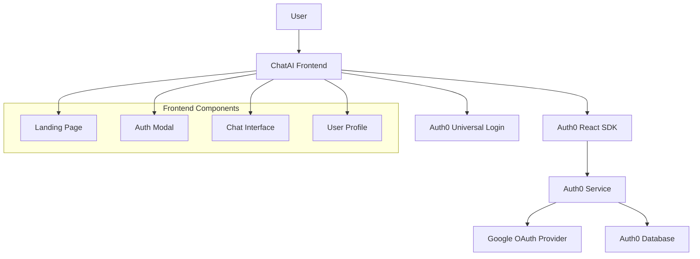
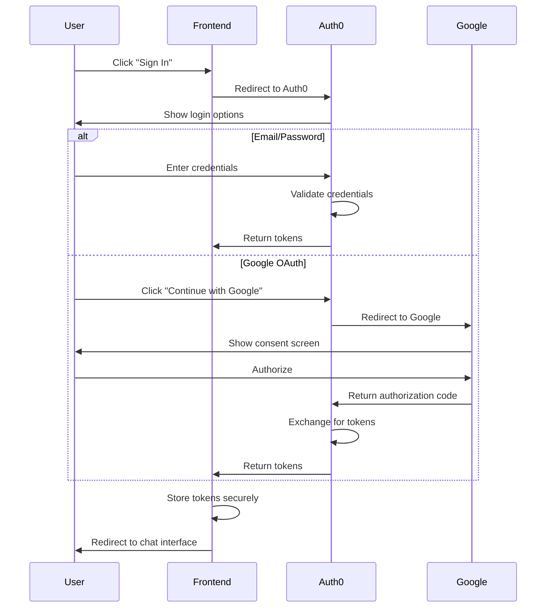

# Auth0 Authentication Integration Design

## Overview

This design document outlines the integration of Auth0 authentication service into the ChatAI application. The solution will replace the current mock authentication with a production-ready system supporting email/password and Google OAuth authentication, while improving the UI/UX of the authentication forms.

## Architecture

### High-Level Architecture



### Authentication Flow



## Components and Interfaces

### 1. Auth0 Configuration

**File:** `lib/auth0.ts`
```typescript
interface Auth0Config {
  domain: string;
  clientId: string;
  redirectUri: string;
  audience?: string;
}

interface Auth0ProviderOptions extends Auth0Config {
  children: React.ReactNode;
}
```

**Environment Variables:**
- `NEXT_PUBLIC_AUTH0_DOMAIN`
- `NEXT_PUBLIC_AUTH0_CLIENT_ID`
- `NEXT_PUBLIC_AUTH0_REDIRECT_URI`
- `AUTH0_CLIENT_SECRET` (for server-side operations)

### 2. Authentication Context

**File:** `contexts/auth-context.tsx`
```typescript
interface AuthContextType {
  user: User | null;
  isLoading: boolean;
  isAuthenticated: boolean;
  loginWithRedirect: () => Promise<void>;
  loginWithPopup: () => Promise<void>;
  logout: () => void;
  getAccessTokenSilently: () => Promise<string>;
}

interface User {
  sub: string;
  name: string;
  email: string;
  picture: string;
  email_verified: boolean;
}
```

### 3. Enhanced Auth Modal Component

**File:** `components/auth-modal.tsx`
```typescript
interface AuthModalProps {
  isOpen: boolean;
  onClose: () => void;
  initialMode?: "signin" | "signup";
}

interface AuthFormData {
  name?: string;
  email: string;
  password: string;
}
```

### 4. Google Sign-In Button Component

**File:** `components/google-signin-button.tsx`
```typescript
interface GoogleSignInButtonProps {
  mode: "signin" | "signup";
  onSuccess?: () => void;
  onError?: (error: Error) => void;
  disabled?: boolean;
}
```

### 5. Protected Route Component

**File:** `components/protected-route.tsx`
```typescript
interface ProtectedRouteProps {
  children: React.ReactNode;
  fallback?: React.ReactNode;
}
```

## Data Models

### User Profile Model
```typescript
interface UserProfile {
  id: string;
  email: string;
  name: string;
  picture?: string;
  emailVerified: boolean;
  createdAt: string;
  lastLogin: string;
  authProvider: 'auth0' | 'google-oauth2';
}
```

### Authentication State Model
```typescript
interface AuthState {
  isAuthenticated: boolean;
  isLoading: boolean;
  user: UserProfile | null;
  error: string | null;
  accessToken: string | null;
}
```

## Error Handling

### Error Types
```typescript
enum AuthErrorType {
  NETWORK_ERROR = 'network_error',
  INVALID_CREDENTIALS = 'invalid_credentials',
  USER_NOT_FOUND = 'user_not_found',
  EMAIL_NOT_VERIFIED = 'email_not_verified',
  OAUTH_ERROR = 'oauth_error',
  TOKEN_EXPIRED = 'token_expired',
  UNKNOWN_ERROR = 'unknown_error'
}

interface AuthError {
  type: AuthErrorType;
  message: string;
  details?: any;
}
```

### Error Handling Strategy
1. **Network Errors**: Show retry button with exponential backoff
2. **Validation Errors**: Display field-specific error messages
3. **OAuth Errors**: Provide alternative authentication methods
4. **Token Expiration**: Automatically attempt token refresh
5. **Service Unavailable**: Show status page with updates

## UI/UX Design Improvements

### Form Input Styling
```css
.auth-input-container {
  position: relative;
  margin-bottom: 1rem;
}

.auth-input-icon {
  position: absolute;
  left: 12px;
  top: 50%;
  transform: translateY(-50%);
  color: var(--color-muted-foreground);
  z-index: 1;
}

.auth-input {
  width: 100%;
  padding: 12px 16px 12px 44px; /* Left padding for icon */
  border: 1px solid var(--color-border);
  border-radius: 8px;
  background: var(--color-background);
  color: var(--color-foreground);
  font-size: 14px;
  transition: all 0.2s ease;
}

.auth-input:focus {
  outline: none;
  border-color: var(--color-primary);
  box-shadow: 0 0 0 2px rgba(var(--color-primary), 0.1);
}
```

### Google Sign-In Button Design
```css
.google-signin-button {
  display: flex;
  align-items: center;
  justify-content: center;
  gap: 12px;
  width: 100%;
  padding: 12px 16px;
  border: 1px solid var(--color-border);
  border-radius: 8px;
  background: white;
  color: #1f1f1f;
  font-size: 14px;
  font-weight: 500;
  cursor: pointer;
  transition: all 0.2s ease;
}

.google-signin-button:hover {
  background: #f8f9fa;
  box-shadow: 0 2px 4px rgba(0, 0, 0, 0.1);
}

.google-signin-button:disabled {
  opacity: 0.6;
  cursor: not-allowed;
}
```

### Loading States
- **Button Loading**: Spinner with disabled state
- **Form Loading**: Overlay with loading spinner
- **Page Loading**: Skeleton components for user profile

### Responsive Design
- **Mobile**: Stack form elements vertically, larger touch targets
- **Desktop**: Side-by-side layout for sign-in/sign-up toggle
- **Tablet**: Adaptive layout based on screen width

## Testing Strategy

### Unit Tests
1. **Auth Context**: Test authentication state management
2. **Auth Modal**: Test form validation and submission
3. **Google Button**: Test OAuth flow initiation
4. **Protected Routes**: Test access control logic

### Integration Tests
1. **Auth0 Integration**: Test token exchange and user profile retrieval
2. **Google OAuth**: Test complete OAuth flow
3. **Session Persistence**: Test token storage and retrieval
4. **Error Scenarios**: Test various error conditions

### E2E Tests
1. **Complete Sign-Up Flow**: From landing page to authenticated state
2. **Complete Sign-In Flow**: Email/password and Google OAuth
3. **Session Management**: Sign out and session expiration
4. **Cross-Browser**: Test on Chrome, Firefox, Safari, Edge

## Security Considerations

### Token Management
- Use Auth0 React SDK's built-in token management
- Implement automatic token refresh
- Clear tokens on sign out
- Use secure HTTP-only cookies where possible

### OAuth Security
- Validate OAuth state parameter
- Use PKCE (Proof Key for Code Exchange) for OAuth flows
- Implement proper redirect URI validation
- Handle OAuth error responses securely

### Data Protection
- Never store sensitive data in localStorage
- Use HTTPS for all authentication communications
- Implement proper CORS policies
- Validate all user inputs on both client and server

## Performance Considerations

### Bundle Size Optimization
- Use dynamic imports for Auth0 SDK
- Implement code splitting for authentication components
- Optimize Google OAuth library loading

### Caching Strategy
- Cache user profile data with appropriate TTL
- Implement optimistic UI updates
- Use React Query for authentication state management

### Loading Performance
- Preload authentication components
- Implement skeleton loading states
- Use service worker for offline authentication status

## Migration Strategy

### Phase 1: Setup and Configuration
1. Install Auth0 React SDK
2. Configure environment variables
3. Set up Auth0 application in dashboard
4. Configure Google OAuth provider

### Phase 2: Core Authentication
1. Implement Auth0 provider wrapper
2. Create authentication context
3. Update auth modal with real authentication
4. Implement protected routes

### Phase 3: UI/UX Improvements
1. Fix input field icon positioning
2. Implement Google sign-in button
3. Add loading states and error handling
4. Improve responsive design

### Phase 4: Testing and Polish
1. Add comprehensive tests
2. Implement error boundaries
3. Add analytics and monitoring
4. Performance optimization

## Monitoring and Analytics

### Authentication Metrics
- Sign-up conversion rates
- Sign-in success/failure rates
- OAuth provider usage statistics
- Session duration and retention

### Error Monitoring
- Authentication error rates by type
- Network failure rates
- Token refresh failure rates
- User experience issues

### Performance Metrics
- Authentication flow completion time
- Token refresh latency
- Component loading times
- Bundle size impact