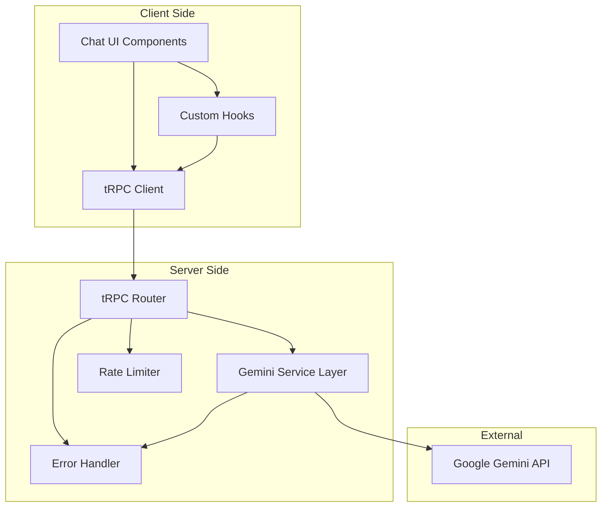

# Google Gemini API Integration Design

## Overview

This design document outlines the integration of Google Gemini API into the ChatAI application, providing both text generation (Gemini Pro) and image generation (Gemini Pro Vision) capabilities. The integration will leverage the existing tRPC architecture, maintain consistency with the current chat interface, and provide streaming responses with proper error handling.

The solution will extend the current tRPC router with new Gemini-specific procedures, implement streaming capabilities for real-time responses, and integrate seamlessly with the existing chat UI components.

## Architecture

### High-Level Architecture



### Component Architecture

The integration will follow a layered architecture:

1. **UI Layer**: Existing chat components with minimal modifications
2. **Hook Layer**: Custom React hooks for Gemini operations
3. **tRPC Layer**: Type-safe API procedures for Gemini calls
4. **Service Layer**: Business logic for Gemini API interactions
5. **API Layer**: Direct integration with Google Gemini API

## Components and Interfaces

### 1. Gemini Service Layer

**File**: `lib/gemini.ts`

```typescript
interface GeminiConfig {
  apiKey: string;
  baseUrl?: string;
  timeout?: number;
  maxRetries?: number;
}

interface GeminiTextRequest {
  prompt: string;
  stream?: boolean;
  maxTokens?: number;
  temperature?: number;
}

interface GeminiImageRequest {
  prompt: string;
  size?: 'small' | 'medium' | 'large';
  style?: string;
}

interface GeminiResponse {
  id: string;
  content: string;
  type: 'text' | 'image';
  timestamp: Date;
  metadata?: Record<string, any>;
}

class GeminiService {
  generateText(request: GeminiTextRequest): Promise<GeminiResponse>
  generateTextStream(request: GeminiTextRequest): AsyncIterable<string>
  generateImage(request: GeminiImageRequest): Promise<GeminiResponse>
  validateApiKey(): Promise<boolean>
}
```

### 2. tRPC Router Extensions

**File**: `server/routers/gemini.ts`

```typescript
export const geminiRouter = router({
  generateText: publicProcedure
    .input(z.object({
      prompt: z.string().min(1).max(4000),
      stream: z.boolean().default(false),
      maxTokens: z.number().optional(),
      temperature: z.number().min(0).max(2).optional(),
    }))
    .mutation(async ({ input }) => { /* implementation */ }),

  generateTextStream: publicProcedure
    .input(z.object({
      prompt: z.string().min(1).max(4000),
      maxTokens: z.number().optional(),
      temperature: z.number().optional(),
    }))
    .subscription(async function* ({ input }) { /* implementation */ }),

  generateImage: publicProcedure
    .input(z.object({
      prompt: z.string().min(1).max(1000),
      size: z.enum(['small', 'medium', 'large']).default('medium'),
      style: z.string().optional(),
    }))
    .mutation(async ({ input }) => { /* implementation */ }),

  validateConfig: publicProcedure
    .query(async () => { /* implementation */ }),
});
```

### 3. Custom React Hooks

**File**: `hooks/use-gemini.ts`

```typescript
interface UseGeminiOptions {
  onSuccess?: (response: GeminiResponse) => void;
  onError?: (error: Error) => void;
  onStreamChunk?: (chunk: string) => void;
}

export function useGemini(options?: UseGeminiOptions) {
  const generateText: (prompt: string, options?: GeminiTextRequest) => void;
  const generateImage: (prompt: string, options?: GeminiImageRequest) => void;
  const isGenerating: boolean;
  const error: Error | null;
  const streamingContent: string;
}
```

### 4. Enhanced Chat Components

**Modifications to existing components**:

- `components/ai-input-search.tsx`: Add image generation toggle
- `hooks/use-chat.ts`: Integrate Gemini hooks
- New component: `components/gemini-message.tsx` for displaying Gemini responses

### 5. Message Types Extension

```typescript
interface ChatMessage {
  id: string;
  content: string;
  type: 'user' | 'ai' | 'gemini-text' | 'gemini-image';
  timestamp: Date;
  metadata?: {
    model?: string;
    tokens?: number;
    imageUrl?: string;
    isStreaming?: boolean;
  };
}
```

## Data Models

### 1. Configuration Model

```typescript
interface GeminiConfiguration {
  apiKey: string;
  models: {
    text: string; // 'gemini-pro'
    vision: string; // 'gemini-pro-vision'
  };
  limits: {
    maxTokens: number;
    requestsPerMinute: number;
    requestsPerDay: number;
  };
  features: {
    streaming: boolean;
    imageGeneration: boolean;
  };
}
```

### 2. Request/Response Models

```typescript
interface GeminiTextGenerationRequest {
  prompt: string;
  model: 'gemini-pro';
  stream: boolean;
  generationConfig?: {
    temperature?: number;
    topP?: number;
    topK?: number;
    maxOutputTokens?: number;
  };
}

interface GeminiImageGenerationRequest {
  prompt: string;
  model: 'gemini-pro-vision';
  generationConfig?: {
    temperature?: number;
  };
}

interface GeminiStreamResponse {
  candidates: Array<{
    content: {
      parts: Array<{
        text: string;
      }>;
    };
    finishReason?: string;
  }>;
}
```

### 3. Error Models

```typescript
interface GeminiError {
  code: 'API_KEY_INVALID' | 'RATE_LIMIT_EXCEEDED' | 'QUOTA_EXCEEDED' | 'NETWORK_ERROR' | 'UNKNOWN';
  message: string;
  details?: Record<string, any>;
  retryAfter?: number;
}
```

## Error Handling

### 1. Error Classification

- **Authentication Errors**: Invalid API key, expired credentials
- **Rate Limiting Errors**: Too many requests, quota exceeded
- **Network Errors**: Connection timeouts, DNS failures
- **Validation Errors**: Invalid input parameters
- **Service Errors**: Gemini API unavailable, internal server errors

### 2. Error Handling Strategy

```typescript
class GeminiErrorHandler {
  handleError(error: unknown): GeminiError {
    // Classify and transform errors
  }
  
  shouldRetry(error: GeminiError): boolean {
    // Determine if request should be retried
  }
  
  getRetryDelay(attempt: number): number {
    // Exponential backoff calculation
  }
}
```

### 3. User-Facing Error Messages

- **API Key Issues**: "Please check your Gemini API configuration"
- **Rate Limits**: "Too many requests. Please wait a moment and try again"
- **Network Issues**: "Connection error. Please check your internet connection"
- **Service Unavailable**: "Gemini service is temporarily unavailable"

## Testing Strategy

### 1. Unit Tests

- **Service Layer Tests**: Mock Gemini API responses
- **tRPC Procedure Tests**: Test input validation and error handling
- **Hook Tests**: Test React hook behavior and state management
- **Error Handler Tests**: Test error classification and retry logic

### 2. Integration Tests

- **API Integration**: Test actual Gemini API calls (with test API key)
- **Streaming Tests**: Test real-time response streaming
- **Rate Limiting Tests**: Test rate limit handling
- **End-to-End Tests**: Test complete user workflows

### 3. Test Data and Mocking

```typescript
// Mock Gemini API responses
const mockGeminiTextResponse = {
  candidates: [{
    content: {
      parts: [{ text: "This is a test response from Gemini" }]
    },
    finishReason: "STOP"
  }]
};

// Mock streaming response
const mockGeminiStreamResponse = function* () {
  yield { candidates: [{ content: { parts: [{ text: "This " }] } }] };
  yield { candidates: [{ content: { parts: [{ text: "is " }] } }] };
  yield { candidates: [{ content: { parts: [{ text: "streaming" }] } }] };
};
```

### 4. Performance Testing

- **Response Time**: Measure API call latency
- **Streaming Performance**: Test streaming chunk delivery
- **Memory Usage**: Monitor memory consumption during streaming
- **Concurrent Requests**: Test multiple simultaneous requests

## Implementation Phases

### Phase 1: Core Infrastructure
- Set up Gemini service layer
- Implement basic tRPC procedures
- Add environment configuration
- Basic error handling

### Phase 2: Text Generation
- Implement text generation API
- Add streaming support
- Integrate with existing chat UI
- Add rate limiting

### Phase 3: Image Generation
- Implement image generation API
- Add image display in chat
- Handle image-specific errors
- Add image caching

### Phase 4: Advanced Features
- Add retry mechanisms
- Implement usage analytics
- Add configuration management
- Performance optimizations

### Phase 5: Testing and Polish
- Comprehensive test coverage
- Error message refinement
- Performance tuning
- Documentation updates

## Security Considerations

### 1. API Key Management
- Store API keys in environment variables
- Never expose API keys in client-side code
- Implement API key rotation support
- Add API key validation on startup

### 2. Input Validation
- Sanitize user prompts
- Implement content filtering
- Validate request parameters
- Prevent injection attacks

### 3. Rate Limiting
- Implement client-side rate limiting
- Add server-side request throttling
- Monitor usage patterns
- Implement fair usage policies

### 4. Data Privacy
- Don't log sensitive user inputs
- Implement request/response sanitization
- Add opt-out mechanisms
- Comply with data retention policies

## Performance Optimizations

### 1. Caching Strategy
- Cache frequently requested responses
- Implement response deduplication
- Add cache invalidation logic
- Use appropriate cache TTL values

### 2. Streaming Optimizations
- Implement efficient chunk processing
- Add connection pooling
- Optimize memory usage
- Handle connection interruptions

### 3. Request Optimization
- Batch similar requests when possible
- Implement request prioritization
- Add request cancellation support
- Optimize payload sizes

## Monitoring and Analytics

### 1. Metrics Collection
- API response times
- Error rates by type
- Usage patterns
- Token consumption

### 2. Logging Strategy
- Structured logging for debugging
- Error tracking and alerting
- Performance monitoring
- Usage analytics

### 3. Health Checks
- API connectivity monitoring
- Service availability checks
- Performance threshold alerts
- Quota usage monitoring